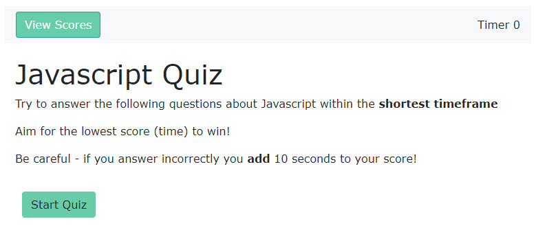
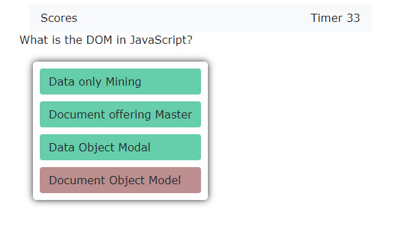
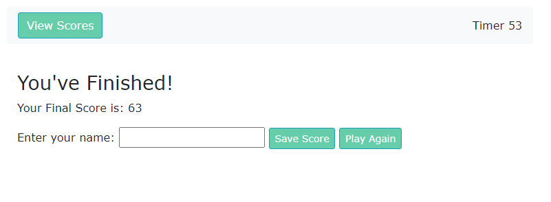

# Week 4 Homework: Web API's Code Quiz

## User Story

```
AS A coding bootcamp student
I WANT to take a timed quiz on JavaScript fundamentals that stores time as scores - the aim is to get the lowest time possible
SO THAT I can gauge my progress compared to my peers
```

## Acceptance Criteria

```
GIVEN I am taking a code quiz
WHEN I click the start button
THEN a timer starts and I am presented with a question
WHEN I answer a question
THEN I am presented with another question
WHEN I answer a question incorrectly
THEN penalty time of 10 seconds is added to the clock
WHEN all questions are answered 
THEN the game is over
WHEN the game is over my score is the amount on timer + penalty time
THEN I can save my initials and score

```
## My Quiz:  https://mulys001.github.io/Code-Quiz/

My quiz was developed using Javascript & JQuery.  I applied Bootstrap elements for styling as well as what I put in my style.css.

Quiz Questions were mainly sourced from W3Schools: https://www.w3schools.com/quiztest/quiztest.asp?qtest=JS.  I did put my own twist on some of the questions.

## Summary of my efforts
I was able to generate the different sections of the quiz and the answer selections for each question.
I am not fully satisfied with my efforts as I did not end up building the capability to retrieve scores nor a 'Play Again' button as I orginally hoped to do.

This is something I'd like to revisit as my skills improve.

## Screenshots of my quiz:

### Main Page


### Questions Page (example)


### Results Page

